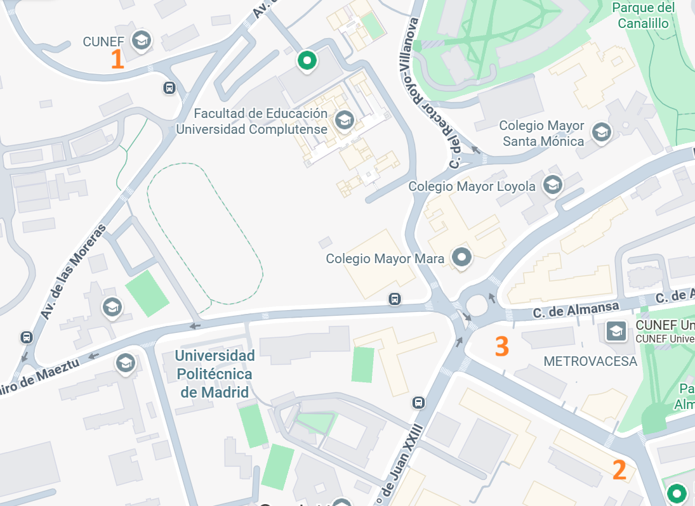

```{=html}
<section class="page-intro">
  <p class="section-kicker">Practical information</p>
  <h1>Venue and documents</h1>
  <p>The workshop will be held at the LPC Campus of CUNEF Universidad in Madrid.</p>
</section>

<section class="info-grid">
  <article class="info-panel">
    <i class="bi bi-geo-alt" aria-hidden="true"></i>
    <h2>Workshop venue</h2>
    <p><strong>Room:</strong> Aula F1.2 &ndash; LPC Campus</p>
    <p><strong>Address:</strong> C. de Leonardo Prieto Castro, 2, Moncloa-Aravaca, 28040 Madrid</p>
    <a class="inline-link" href="https://www.google.com/maps/search/?api=1&query=C.%20de%20Leonardo%20Prieto%20Castro%202%20Madrid" target="_blank" rel="noopener">Open venue map</a>
  </article>
  <article class="info-panel">
    <i class="bi bi-camera" aria-hidden="true"></i>
    <h2>Group photo</h2>
    <p>The group photo will be taken at the entrance of the ALMANSA campus on Thursday, 4 June 2026 at 20:00.</p>
  </article>
  <article class="info-panel">
    <i class="bi bi-cup-hot" aria-hidden="true"></i>
    <h2>Conference dinner</h2>
    <p><strong>Date:</strong> Thursday, 4 June 2026 at 20:30</p>
    <p><strong>Restaurant:</strong> Sal Gorda, C. de Beatriz de Bobadilla 9, Moncloa-Aravaca, 28040 Madrid</p>
    <p><strong>Cost:</strong> 40 EUR per person, payable at the restaurant.</p>
  </article>
  <article class="info-panel">
    <i class="bi bi-envelope" aria-hidden="true"></i>
    <h2>Contact</h2>
    <p>For last-minute questions or problems, contact <a href="mailto:roi.naveiro@cunef.edu">roi.naveiro@cunef.edu</a>.</p>
  </article>
</section>

<section class="map-section">
  <div>
    <p class="section-kicker">Conference locations</p>
    <h2>Locations map</h2>
    <ol class="location-list">
      <li><strong>LPC Campus:</strong> workshop venue.</li>
      <li><strong>Restaurant Sal Gorda:</strong> conference dinner.</li>
      <li><strong>ALMANSA campus entrance:</strong> group photo location, not the workshop venue.</li>
    </ol>
  </div>
  
</section>

<section class="section downloads-band compact" id="downloads">
  <div class="downloads-layout">
    <div>
      <p class="section-kicker">Downloads</p>
      <h2>Workshop documents</h2>
      <p>The book of abstracts and brochure are available as PDFs.</p>
    </div>
    <div class="download-cards">
      <a class="download-card" href="book_of_abstracts_bayes_cunef.pdf" download>
        <i class="bi bi-file-earmark-pdf" aria-hidden="true"></i>
        <span>Book of Abstracts</span>
        <small>PDF</small>
      </a>
      <a class="download-card" href="folleto-2pag.pdf" download>
        <i class="bi bi-file-earmark-arrow-down" aria-hidden="true"></i>
        <span>Brochure</span>
        <small>PDF</small>
      </a>
    </div>
  </div>
</section>
```
