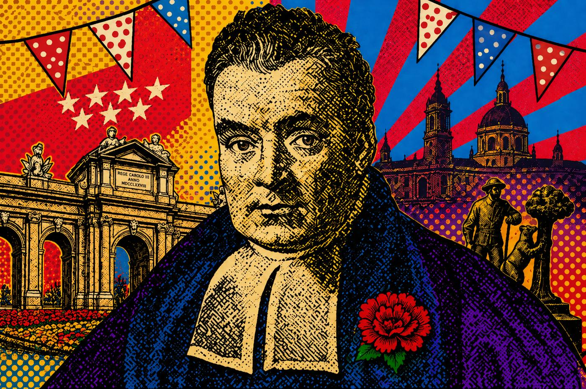

```{=html}
<section class="hero hero--event">
  <div class="hero__overlay"></div>
  <div class="hero__content">
    <p class="eyebrow">Archive &bull; CUNEF Universidad, Madrid &bull; June 4&ndash;5, 2026</p>
    <h1>II International Workshop on Bayesian Statistics</h1>
    <p class="hero__lead">
      Organised by the Bayesian Working Group of SEIO and CUNEF Universidad. The workshop has taken place; this page is its record.
    </p>
    <div class="hero__actions">
      <a class="button button--primary" href="program.html">
        <i class="bi bi-calendar-event" aria-hidden="true"></i>
        View programme
      </a>
      <a class="button button--light" href="book_of_abstracts_bayes_cunef.pdf" download>
        <i class="bi bi-download" aria-hidden="true"></i>
        Book of abstracts
      </a>
    </div>
  </div>
</section>

<section class="logo-strip" aria-label="Organising institutions">
  
  
  
</section>

<section class="section section--intro">
  <div class="container two-column">
    <div>
      <p class="section-kicker">The workshop</p>
      <h2>Workshop overview</h2>
    </div>
    <div class="copy-block">
      <p>
        The II International Workshop on Bayesian Statistics took place on 4&ndash;5 June 2026 at CUNEF Universidad, Madrid, following the first edition held in 2024 at Universidad Carlos III de Madrid.
      </p>
      <p>
        It was a single-track meeting of seven keynote lectures and five contributed sessions, covering model selection, Bayesian computation, spatial and temporal modelling, financial econometrics, adversarial and robust machine learning, and applied Bayesian methods. Several sessions were reserved for early-career researchers. The workshop was funded by SEIO and CUNEF Universidad, and registration was free of charge.
      </p>
      <dl class="info-panel facts">
        <div>
          <dt>Dates</dt>
          <dd>4&ndash;5 June 2026</dd>
        </div>
        <div>
          <dt>Venue</dt>
          <dd>Aula F1.2, LPC Campus, CUNEF Universidad, Madrid</dd>
        </div>
        <div>
          <dt>Format</dt>
          <dd>Single track; seven keynote lectures and five contributed sessions</dd>
        </div>
        <div>
          <dt>Funding</dt>
          <dd>SEIO and CUNEF Universidad; registration free of charge</dd>
        </div>
        <div>
          <dt>Preceded by</dt>
          <dd>I International Workshop on Bayesian Statistics, Universidad Carlos III de Madrid, 17&ndash;18 June 2024</dd>
        </div>
      </dl>
    </div>
  </div>
</section>

<section class="section section--muted">
  <div class="container">
    <div class="section-heading">
      <p class="section-kicker">Scientific programme</p>
      <h2>Keynote speakers</h2>
    </div>
    <div class="speaker-grid">
      <article class="speaker"><span>Peter M&uuml;ller</span><em>The University of Texas at Austin</em><small>A semi-parametric Bayesian GLM and applications to outcome dependent sampling</small></article>
      <article class="speaker"><span>David Rossell</span><em>Universitat Pompeu Fabra</em><small>High-dimensional model selection: transfer learning and projected computation</small></article>
      <article class="speaker"><span>Stefano Cabras</span><em>Universidad Carlos III de Madrid</em><small>Objective Bayesian Model Uncertainty Quantification under Missing Data</small></article>
      <article class="speaker"><span>Sylvia Fr&uuml;hwirth-Schnatter</span><em>WU Wien</em><small>Sparse Bayesian Factor Analysis for Gaussian and non-Gaussian Data</small></article>
      <article class="speaker"><span>Mar&iacute;a Dolores Ugarte</span><em>Universidad P&uacute;blica de Navarra</em><small>On smoothing risk patterns in areal data</small></article>
      <article class="speaker"><span>Jos&eacute; Miguel Hern&aacute;ndez-Lobato</span><em>University of Cambridge</em><small>Advances in Scalable Gaussian Processes</small></article>
      <article class="speaker"><span>Daniel Hern&aacute;ndez-Lobato</span><em>Universidad Aut&oacute;noma de Madrid</em><small>Joint entropy search for multi-objective Bayesian optimization with constraints and multiple fidelities</small></article>
    </div>
  </div>
</section>

<section class="section downloads-band" id="downloads">
  <div class="container downloads-layout">
    <div>
      <p class="section-kicker">Documents</p>
      <h2>Workshop documents</h2>
      <p>The book of abstracts and the workshop brochure are preserved as PDFs. The detailed programme, the venue and the committees are on their own pages.</p>
    </div>
    <div class="download-cards">
      <a class="download-card" href="book_of_abstracts_bayes_cunef.pdf" download>
        <i class="bi bi-file-earmark-pdf" aria-hidden="true"></i>
        <span>Book of Abstracts</span>
        <small>PDF</small>
      </a>
      <a class="download-card" href="folleto-2pag.pdf" download>
        <i class="bi bi-file-earmark-arrow-down" aria-hidden="true"></i>
        <span>Brochure</span>
        <small>PDF</small>
      </a>
      <a class="download-card" href="program.html">
        <i class="bi bi-calendar-event" aria-hidden="true"></i>
        <span>Detailed programme</span>
        <small>Web</small>
      </a>
      <a class="download-card" href="about.html">
        <i class="bi bi-geo-alt" aria-hidden="true"></i>
        <span>Venue and committees</span>
        <small>Web</small>
      </a>
    </div>
  </div>
</section>
```
