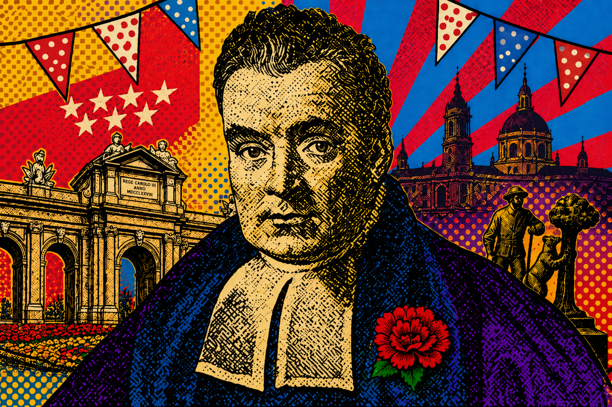

```{=html}
<section class="hero">
  <div class="hero__overlay"></div>
  <div class="hero__content">
    <p class="eyebrow">CUNEF Universidad, Madrid &bull; June 4&ndash;5, 2026</p>
    <h1>II International Workshop on Bayesian Statistics</h1>
    <p class="hero__lead">
      Organised by the Bayesian Working Group of SEIO and CUNEF Universidad.
    </p>
    <div class="hero__actions">
      <a class="button button--primary" href="program.html">
        <i class="bi bi-calendar-event" aria-hidden="true"></i>
        View program
      </a>
      <a class="button button--light" href="book_of_abstracts_bayes_cunef.pdf" download>
        <i class="bi bi-download" aria-hidden="true"></i>
        Book of abstracts
      </a>
    </div>
  </div>
</section>

<section class="logo-strip" aria-label="Organising institutions">
  
  
  
</section>

<section class="section section--intro">
  <div class="container two-column">
    <div>
      <p class="section-kicker">Workshop Overview</p>
      <h2>Workshop overview</h2>
    </div>
    <div class="copy-block">
      <p>
        The II International Workshop on Bayesian Statistics will take place on 4&ndash;5 June 2026 at CUNEF Universidad, Madrid. The workshop is organised by the Bayesian Working Group of SEIO and CUNEF Universidad.
      </p>
      <p>
        The meeting is planned as a single-track event with plenary talks, contributed sessions, coffee breaks, lunches, and a closing session. Registration is free thanks to the support of SEIO and CUNEF Universidad.
      </p>
    </div>
  </div>
</section>

<section class="section section--muted">
  <div class="container">
    <div class="section-heading">
      <p class="section-kicker">Scientific program</p>
      <h2>Keynote speakers</h2>
    </div>
    <div class="speaker-grid">
      <article class="speaker"><span>Peter M&uuml;ller</span><small>A semi-parametric Bayesian GLM and applications to outcome dependent sampling</small></article>
      <article class="speaker"><span>David Rossell</span><small>High-dimensional model selection: transfer learning and projected computation</small></article>
      <article class="speaker"><span>Stefano Cabras</span><small>Objective Bayesian Model Uncertainty Quantification under Missing Data</small></article>
      <article class="speaker"><span>Sylvia Fr&uuml;hwirth-Schnatter</span><small>Sparse Bayesian Factor Analysis for Gaussian and non-Gaussian Data</small></article>
      <article class="speaker"><span>Lola Ugarte</span><small>On smoothing risk patterns in areal data</small></article>
      <article class="speaker"><span>Jos&eacute; Miguel Hern&aacute;ndez-Lobato</span><small>Advances in Scalable Gaussian Processes</small></article>
      <article class="speaker"><span>Daniel Hern&aacute;ndez-Lobato</span><small>Joint entropy search for multi-objective Bayesian optimization with constraints and multiple fidelities</small></article>
    </div>
  </div>
</section>

<section class="section downloads-band" id="downloads">
  <div class="container downloads-layout">
    <div>
      <p class="section-kicker">Documents</p>
      <h2>Workshop documents</h2>
      <p>The book of abstracts and the workshop brochure are available as PDFs.</p>
    </div>
    <div class="download-cards">
      <a class="download-card" href="book_of_abstracts_bayes_cunef.pdf" download>
        <i class="bi bi-file-earmark-pdf" aria-hidden="true"></i>
        <span>Book of Abstracts</span>
        <small>PDF</small>
      </a>
      <a class="download-card" href="folleto-2pag.pdf" download>
        <i class="bi bi-file-earmark-arrow-down" aria-hidden="true"></i>
        <span>Folleto</span>
        <small>PDF</small>
      </a>
    </div>
  </div>
</section>
```
