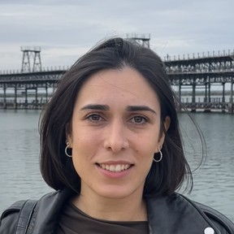
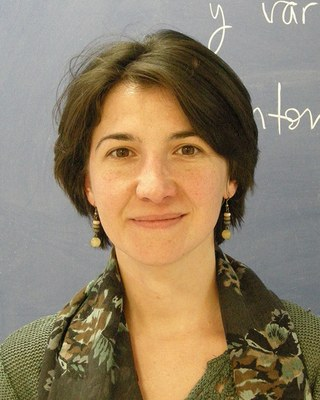
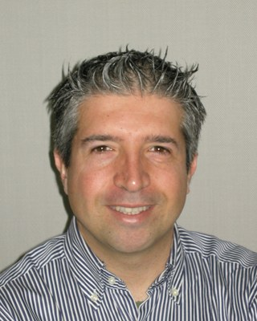
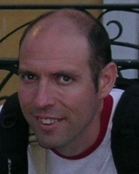

```{=html}
<section class="page-intro">
  <p class="section-kicker">The group</p>
  <h1>People</h1>
  <p>The group is run by two coordinators and a board of four members.</p>
</section>

<section class="section">
  <div class="container">
    <div class="section-heading">
      <p class="section-kicker">Coordination</p>
      <h2>Coordinators</h2>
    </div>
    <div class="people">
      <article class="person">
        
        <div>
          <h3>M. Remedios Sillero-Denamiel</h3>
          <p class="person__affil">Universidad de Sevilla</p>
          <a class="inline-link" href="mailto:rsillero@us.es">rsillero@us.es</a>
        </div>
      </article>
      <article class="person">
        
        <div>
          <h3>Roi Naveiro Flores</h3>
          <p class="person__affil">CUNEF Universidad</p>
          <a class="inline-link" href="mailto:roi.naveiro@cunef.edu">roi.naveiro@cunef.edu</a>
        </div>
      </article>
    </div>
  </div>
</section>

<section class="section section--muted">
  <div class="container">
    <div class="section-heading">
      <p class="section-kicker">Board</p>
      <h2>Board members</h2>
    </div>
    <div class="people">
      <article class="person">
        
        <div>
          <h3>Concepci&oacute;n Aus&iacute;n Olivera</h3>
          <p class="person__affil">Universidad Carlos III de Madrid</p>
          <a class="inline-link" href="mailto:concepcion.ausin@uc3m.es">concepcion.ausin@uc3m.es</a>
        </div>
      </article>
      <article class="person">
        
        <div>
          <h3>Stefano Cabras</h3>
          <p class="person__affil">Universidad Carlos III de Madrid</p>
          <a class="inline-link" href="mailto:stefano.cabras@uc3m.es">stefano.cabras@uc3m.es</a>
        </div>
      </article>
      <article class="person">
        
        <div>
          <h3>Gonzalo Garc&iacute;a-Donato</h3>
          <p class="person__affil">Universidad de Castilla-La Mancha</p>
          <a class="inline-link" href="mailto:gonzalo.garciadonato@uclm.es">gonzalo.garciadonato@uclm.es</a>
        </div>
      </article>
      <article class="person">
        
        <div>
          <h3>Pepa Ram&iacute;rez-Cobo</h3>
          <p class="person__affil">Universidad de C&aacute;diz</p>
          <a class="inline-link" href="mailto:pepa.ramirez@uca.es">pepa.ramirez@uca.es</a>
        </div>
      </article>
    </div>
  </div>
</section>

<section class="section downloads-band compact">
  <div class="downloads-layout">
    <div>
      <p class="section-kicker">Membership</p>
      <h2>Members</h2>
      <p>
        The group brings together researchers and practitioners at Spanish universities and research centres, together with colleagues based abroad. The membership list is kept internally and is not published here.
      </p>
      <p>
        To join the group or to correct an entry, write to the coordinators. Membership of the Society itself is handled by <a href="https://www.seio.es/membership/individual-member/">SEIO</a>.
      </p>
    </div>
    <div class="download-cards">
      <a class="download-card" href="mailto:rsillero@us.es">
        <i class="bi bi-envelope" aria-hidden="true"></i>
        <span>M. Remedios Sillero-Denamiel</span>
        <small>rsillero@us.es</small>
      </a>
      <a class="download-card" href="mailto:roi.naveiro@cunef.edu">
        <i class="bi bi-envelope" aria-hidden="true"></i>
        <span>Roi Naveiro</span>
        <small>roi.naveiro@cunef.edu</small>
      </a>
    </div>
  </div>
</section>
```
